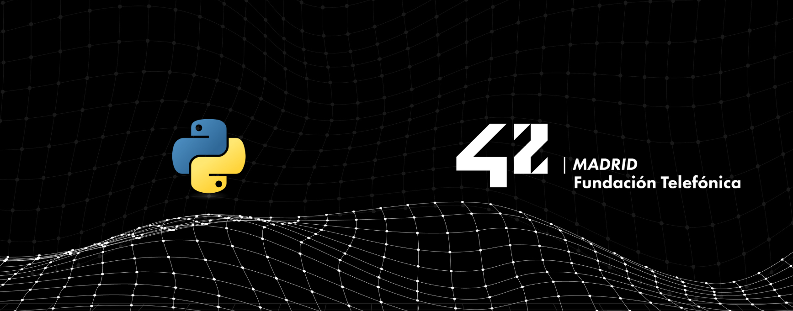

  

## Piscine Python

La **Piscine Python** es la rama del Common Core dedicada a introducir y consolidar el lenguaje **Python** a través de once módulos progresivos. Cada uno aborda un bloque concreto del lenguaje —desde la sintaxis básica hasta la programación funcional— usando escenarios temáticos que hacen el aprendizaje más práctico y memorable.

 > Todos los módulos han sido validados entre febrero y abril de 2026.

---

### Module 00 — Introducción a Python

**Habilidades:** Rigor, Programación orientada a objetos, Programación imperativa

Introducción a la programación en **Python** a través de escenarios prácticos de un **huerto comunitario**. En este módulo se cubren los fundamentos del lenguaje: sintaxis, variables, bucles, condicionales, funciones y tipos básicos, aplicados a la gestión de un jardín digital.

---

### Module 01 — Programación orientada a objetos

**Habilidades:** Rigor, Programación orientada a objetos, Programación imperativa

Aprender **POO** convirtiéndote, sin querer, en un jardinero digital: la mejor forma de entender las clases es cultivar plantas virtuales y darte cuenta de que llevabas tiempo haciendo orientación a objetos. Se trabajan clases, atributos, métodos, constructores y la organización de datos en objetos reutilizables.

---

### Module 02 — Manejo de excepciones

**Habilidades:** Rigor, Programación orientada a objetos, Programación imperativa

Construir **pipelines de datos agrícolas** robustos que no se marchitan. Dominar el manejo de excepciones en Python a través de sistemas de monitorización agrícola inteligente: capturar fallos de sensores, crear alertas personalizadas para las plantas y mantener el invernadero digital funcionando aunque algo falle.

---

### Module 03 — Estructuras de datos

**Habilidades:** Rigor, Programación orientada a objetos, Programación imperativa

Dominar las **estructuras de datos** de Python mientras se construyen y procesan datos de videojuegos. Listas, diccionarios, conjuntos, tuplas y comprensiones aplicadas a inventarios, puntuaciones, coordenadas y logros dentro de un universo lúdico.

---

### Module 04 — Operaciones con archivos

**Habilidades:** Rigor, Programación orientada a objetos, Programación imperativa

Preservar el conocimiento digital dominando las **operaciones con archivos**: lectura y escritura, gestión de flujos de datos y construcción de sistemas de archivo robustos que protegen la información. El foco está en persistencia, formatos y seguridad de los datos almacenados.

---

### Module 05 — Clases abstractas y polimorfismo

**Habilidades:** Rigor, Programación orientada a objetos, Programación imperativa

Dominar **clases abstractas**, sobrescritura de métodos y **polimorfismo por subtipo** construyendo sistemas de procesamiento de datos. Se profundiza en herencia, interfaces implícitas y diseño orientado a contratos entre clases.

---

### Module 06 — Sistema de imports

**Habilidades:** Rigor, Programación orientada a objetos, Programación imperativa

Dominar el **sistema de imports** de Python a través de experimentos alquímicos: control de paquetes con `__init__.py`, estilos de importación, imports absolutos frente a relativos y resolución de **dependencias circulares**.

---

### Module 07 — Patrones de diseño

**Habilidades:** Rigor, Programación orientada a objetos, Programación imperativa

Dominar los **patrones de diseño** de Python con clases abstractas e interfaces construyendo un **sistema modular de cartas**. Se aplican estrategias como composición, capacidades y transformaciones sobre un dominio con reglas de juego bien definidas.

---

### Module 08 — Entornos y gestión de dependencias

**Habilidades:** Rigor, Programación orientada a objetos, Programación imperativa

Bienvenido al mundo real: un proyecto con temática **Matrix** que explora herramientas esenciales de **data engineering** —entornos virtuales, gestión de paquetes con **pip** y **Poetry**, y variables de entorno— a través de tres ejercicios progresivos donde el estudiante se convierte en arquitecto de datos en Zion.

---

### Module 09 — Validación con Pydantic

**Habilidades:** Rigor, Programación orientada a objetos, Programación imperativa

Dominar **Pydantic**, la potente librería de validación de datos de Python, mediante ejercicios con temática espacial. Crear modelos de datos robustos, implementar reglas de validación personalizadas y manejar estructuras anidadas complejas mientras se procesa información.

---

### Module 10 — Programación funcional avanzada

**Habilidades:** Rigor, Programación funcional

Dominar la **programación funcional avanzada** de Python a través de *FuncMage Chronicles*, un RPG cyberpunk épico. Convertirse en un Mago de Funciones en el año 2142 y usar **funciones de orden superior**, **decoradores** y **lambdas** para salvar el reino digital del caos.
